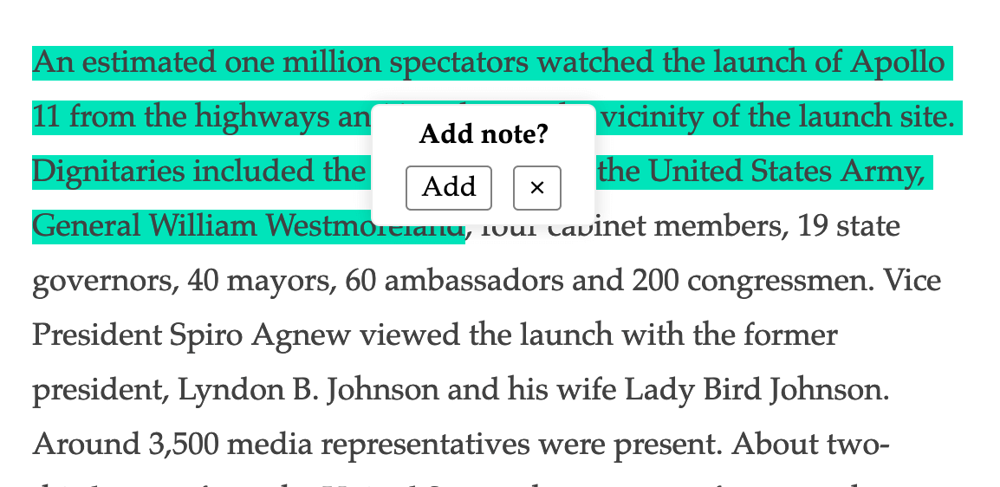
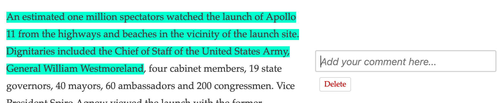
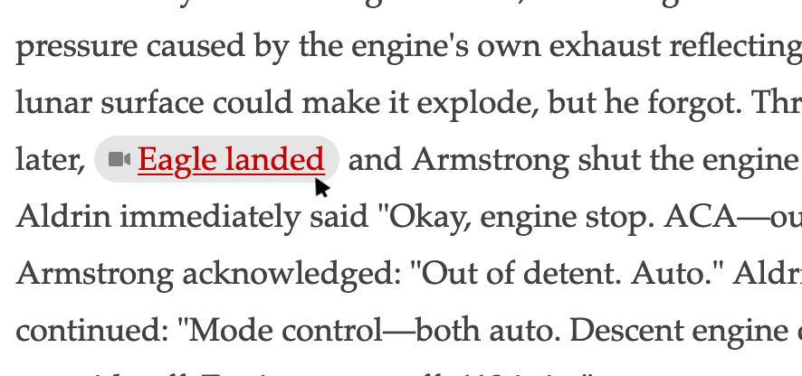
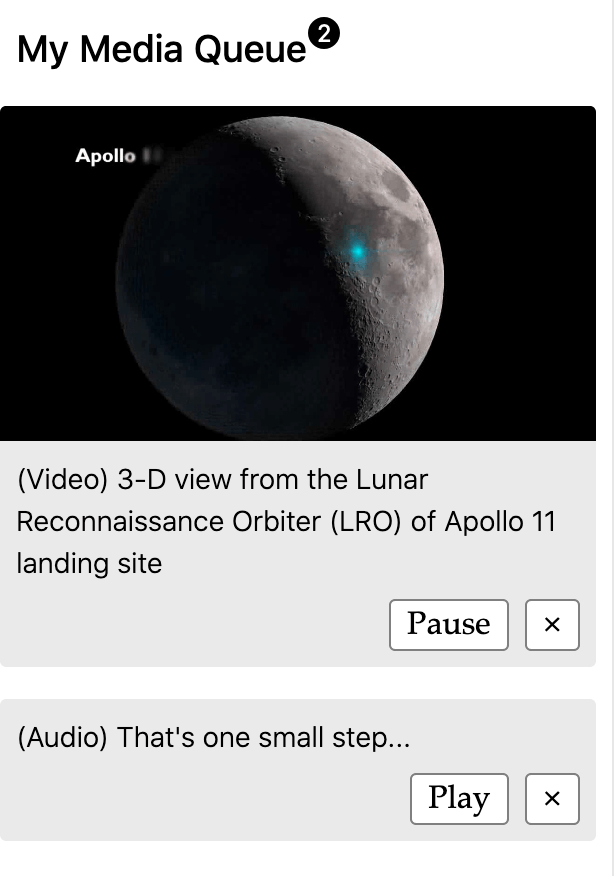

# Apollo 11

An accessible, interactive, prototype built vanilla JS.

Content is accessible without JavaScript and features are added using the progressive enhancement paradigm.

* __[View live app](https://apollo-11.now.sh/)__
* __[View server repo](https://github.com/BlakeEric/apollo-11-api)__

### Using the app

1) Highlight important text to create a note

2) Add, comments, questions, or ideas related to the highlighted text
 

3) Select media to add to the queue.
 

4) Play, pause and replay important media.
 

5) Download a custom PDF study guide including your comments and links to media.
 

__[View now](https://apollo-11.now.sh/)__

## To do:
* add event handlers for text highlight on mobile devices
* scroll window to center note textarea on edit
